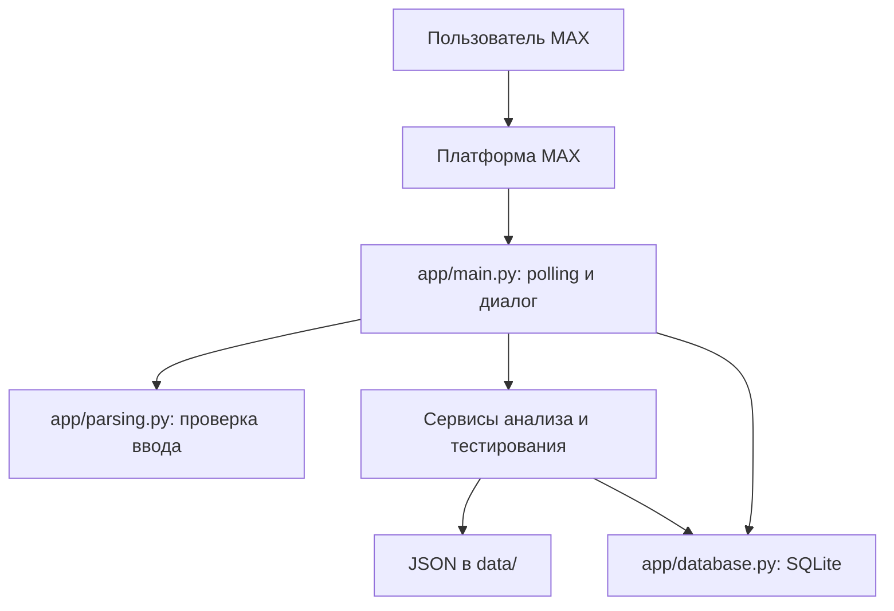

# InternCheck MAX

Чат-бот для первичной самопроверки перед откликом на стажировку по Python Backend. Пользователь вставляет текст стажировки в MAX, получает короткий тест по распознанным навыкам и после ответов видит результат по темам и разбор ошибок.

> Результат отражает ответы на базовые вопросы выбранного теста. Он не оценивает все требования вакансии и не гарантирует приглашение или трудоустройство.

Демо: https://max.ru/t447_hakaton_max_bot

## Что умеет текущая версия

- Принимает текст описания в личном диалоге MAX и проверяет его длину и содержание. Ссылки не открывает; фото, файлы и голосовые сообщения не анализирует.
- Ищет явные упоминания Python, SQL, Git и HTTP/REST по словарю `data/skills.json`. Для подбора теста необходимо упоминание Python и подходящая комбинация тем.
- Выбирает готовый набор вопросов из `data/tests/`, задаёт вопросы по одному и принимает ответ латинской буквой варианта либо его номером.
- Считает общий процент и процент по каждому проверенному навыку. Выводит объяснения ошибок и связанные учебные материалы.
- Сохраняет активный тест, ответы и результаты в SQLite; показывает историю и статистику пользователя.
- Получает события через long polling MAX и отправляет ответы через API платформы.

Анализ требований выполняется правилами и словарём. В текущем коде нет вызовов LLM, автоматического чтения вакансии по URL, кнопок для выбора варианта и webhook.

## Сценарий пользователя

1. Написать `/start` и прислать **текст** Python/backend-стажировки с требованиями, например: `Стажировка Python backend: нужны основы Python, SQL и работа с Git в команде.`
2. Бот выделит поддерживаемые навыки и покажет подготовленный тест и первый вопрос.
3. Ответить буквой из списка вариантов (например, `B`) или номером (`2`). Бот последовательно покажет оставшиеся вопросы.
4. После последнего ответа получить общий балл, результаты по навыкам, разбор неверных ответов и материалы для повторения.

| Команда | Назначение |
| --- | --- |
| `/start` | Приветствие и инструкция |
| `/help` | Справка |
| `/cancel` | Удалить активный тест |
| `/restart` | Удалить активный тест и предложить начать с нового описания |
| `/stats` или `/progress` | Сводная статистика |
| `/history` | До десяти последних результатов |

`/restart` не удаляет сохранённую историю результатов. После завершения теста можно прислать новое описание.

## Оценка

В `data/evaluation_rules.json` установлены рабочие пороги: не менее **70% в целом** и **60% по каждому навыку выбранного теста**. Решение принимается по точным долям до округления отображаемых процентов. Каждый вопрос даёт один балл; итог формируется только после полного прохождения. Эти пороги — правила проекта, а не стандарт работодателей.

Подготовлены три набора: `python_sql_core`, `python_web_git` и `python_backend_full`. Дополнительные темы конкретного выбранного теста участвуют в его оценке, даже если они не были явно перечислены работодателем. Содержимое тестов и правила оценки можно посмотреть в `data/tests/` и `data/evaluation_rules.json`.

## Как устроен проект



| Путь | Роль |
| --- | --- |
| `app/main.py` | Опрос API MAX, обработка сообщений, переход между вопросами и формирование ответа |
| `app/parsing.py` | Нормализация описания и разбор варианта ответа |
| `app/services/analyzer.py` | Выделение навыков по таксономии |
| `app/services/test_engine.py` | Подбор и проверка набора вопросов |
| `app/services/scoring.py` | Подсчёт результата и порогов |
| `app/services/feedback.py` | Разбор ошибок и подбор материалов |
| `app/database.py` | Таблицы и запросы SQLite для сессий, ответов, истории и статистики |
| `app/utils/data_loader.py` | Загрузка JSON-файлов |
| `data/skills.json` | Поддерживаемые навыки и синонимы |
| `data/tests/*.json` | Готовые вопросы и ключи ответов |
| `data/learning_materials.json` | Материалы по ошибочным вопросам |
| `data/evaluation_rules.json` | Пороги и правила оценки |
| `data/internships.json`, `data/demo_cases.json` | Контентные примеры и учебные сценарии; бот не ищет вакансии в этом файле |
| `tests/` | Проверки анализа, ввода, оценивания и выбора теста |

База создаётся при импорте `app/database.py` по пути `data/interncheck.db`. Не добавляйте этот файл и настоящий `.env` в публичный репозиторий.

Порты не используются: бот работает через long polling и не поднимает HTTP-сервер.

## Запуск локально

Нужны Python 3.12 (версия образа Docker), доступ к MAX Bot API и токен своего бота.

```bash
python -m venv .venv
python -m pip install -r requirements.txt
```

Активируйте окружение: в PowerShell — `.venv\Scripts\Activate.ps1`, в bash/zsh — `source .venv/bin/activate`. Скопируйте `.env.example` в `.env` и заполните `BOT_TOKEN`. Пример:

```dotenv
BASE_URL=https://platform-api2.max.ru
BOT_TOKEN=ваш_токен
```

`RATE_LIMIT_RPS` присутствует в примере окружения, но текущий `main.py` использует собственную паузу при отправке и не читает эту переменную.

```bash
python app/main.py
```

Затем откройте личный диалог с ботом в MAX и отправьте `/start`. Для остановки процесса нажмите `Ctrl+C`.

### Docker Compose

Для соединения с MAX API из некоторых сетей требуется сертификат Минцифры  (лежит в `certs/`). 
Dockerfile устанавливает его в системный CA bundle через `REQUESTS_CA_BUNDLE=/etc/ssl/certs/ca-certificates.crt`. 
Без него запросы к platform-api2.max.ru могут падать с SSL-ошибкой.

Контейнер запускается с `network_mode: host` для корректного резолвинга DNS при обращении к MAX API в некоторых сетевых окружениях.

Из корня проекта создайте `.env` с токеном и выполните:

```bash
docker compose up --build
```

```bash
docker compose down      # остановка
docker compose up -d     # повторный запуск в фоне
```

`compose.yaml` запускает один контейнер бота. `compose.yaml` монтирует `./data` как том, поэтому база `interncheck.db` 
переживает пересборку и перезапуск контейнера.

## Проверка

```bash
python -m pytest -q
```
Зависимости уже включают pytest, отдельная установка не нужна» — так яснее, что это не инструкция, а пояснение.

В предоставленном материале видны тесты для анализатора, валидации ввода, оценивания и механизма выбора вопросов. Полноценная работа с реальным MAX и устойчивость SQLite при сбоях требуют отдельной проверки с ботом и окружением команды.

## Ограничения текущей реализации

- Поддерживается только направление Python Backend и ограниченная таксономия из четырёх навыков. Простой поиск терминов не понимает весь смысл вакансии.
- Polling и локальный кэш обработанных сообщений рассчитаны на один процесс. SQLite хранит сессии и результаты, но кэш событий очищается при перезапуске.
- В `database.py` ошибки записи некоторых операций перехватываются и выводятся в консоль; для надёжной эксплуатации важно проверить и усилить их обработку.
- Таблица ответов обновляет запись по паре «пользователь — вопрос». Поэтому `/stats` считает сохранённые записи ответов и не обязан совпадать с суммой ответов за все повторные прохождения. `/history` хранит отдельные результаты завершённых тестов.
- Текущий код показывает первый вопрос сразу после разбора описания. Ранее описанное в старом README подтверждение «да» не является частью этого потока.
- Это MVP для учебной демонстрации. Пороговые значения ещё не откалиброваны по реальным результатам кандидатов.